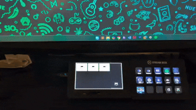
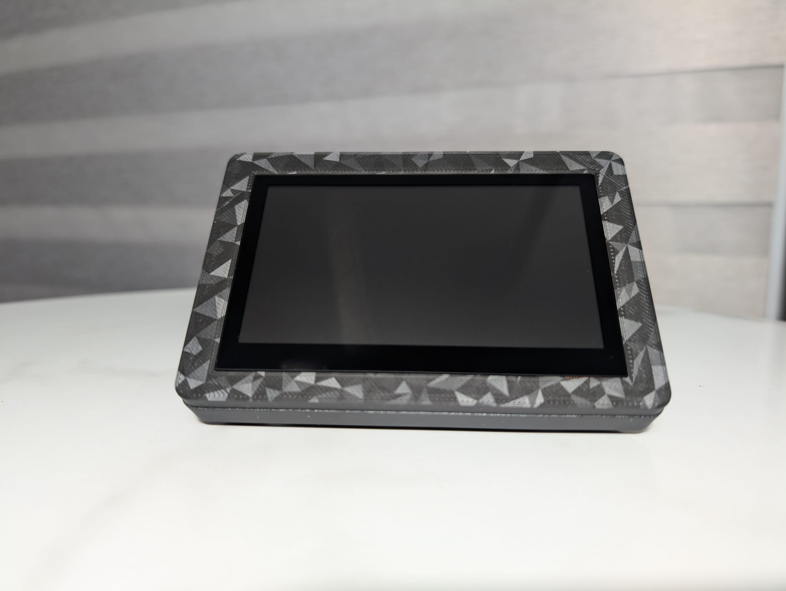

# Guition CYD

Adapted config from this [Git Repo](https://github.com/agillis/esphome-modular-lvgl-buttons)

- Copy the config and update entity details.
- Copy button section to add new buttons and entities.
- I have added 12th button to turn on and off backlight of the device

Download print files from [Printables](https://www.printables.com/model/1446472-guition-cyd-esphome-macropad-stream-deck-footprint)

